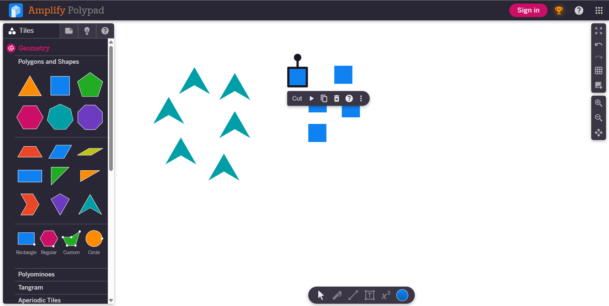
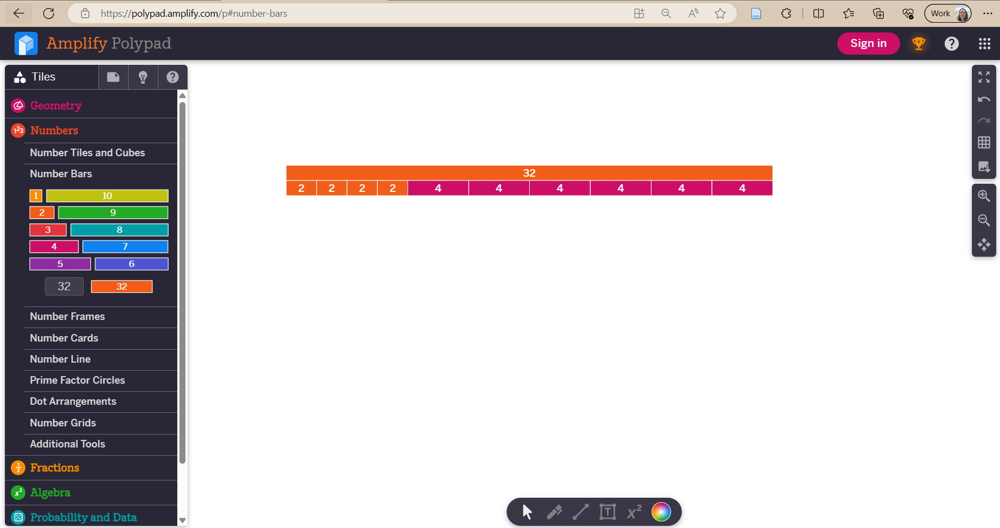
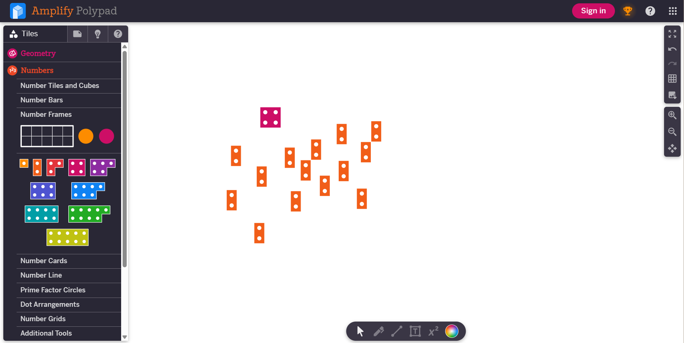
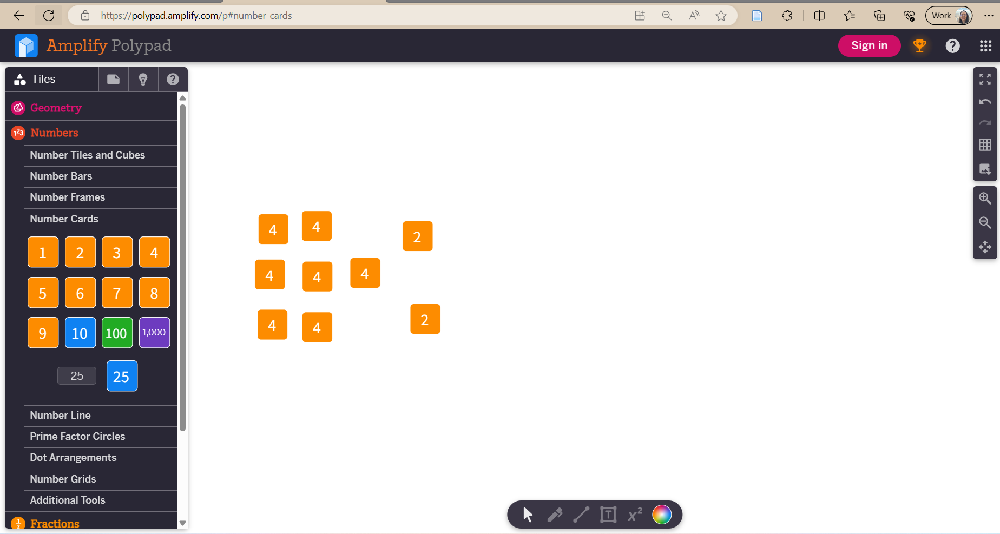
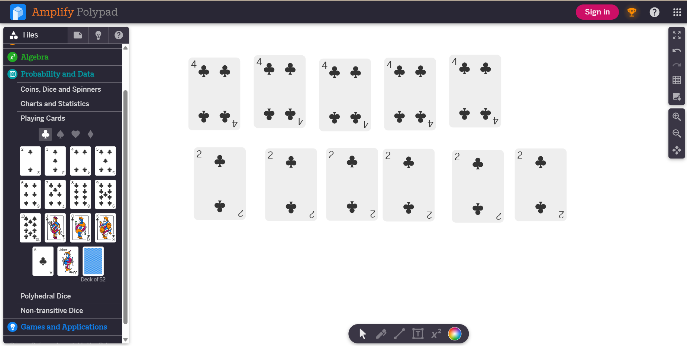
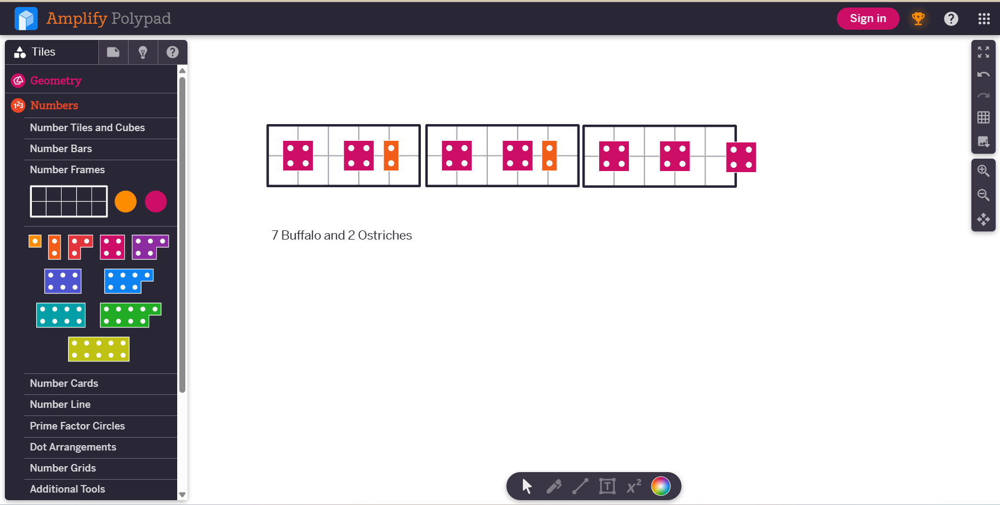

# iPad Station
At the iPad station, the Tech Teacher leads a number talk, and the students use virtual manipulatives on their iPads to solve the problem. The Tech Teacher will have the virtual manipulative site loaded up with suggestions of manipulatives for students to choose from. We recommend the site [Polypad by Amplify](https://polypad.amplify.com/p){:target="_blank"}  over the other free virtual manipulative sites that are available.  

After the students have represented their thinking with the virtual manipulatives, the Tech Teacher will ensure they have taken a screenshot. The Tech Teacher will print the screenshot or post it to the student’s digital portfolio so that they can access it when they are in the self-reflection station the next day.  

## Number Talk Example 
You are at the zoo and it is very busy. This zoo has high fences around the animal pens and you are not tall enough to see over the fence. Each pen has a step that you can stand on that will help you see the animals, but you have to wait your turn. While you are waiting, you look under the fence and count the animals’ legs. 

The sign says that there are ostriches and buffalo in this pen and you count 32 legs. How many ostriches and how many buffalo could there be? 

## Some Virtual Manipulative Options with PolyPad
 
 
 
 
 

## Some Differentiated Problems
For students who have difficulty with flexible thinking: 
- Animals on the sign: Elephants
- Legs counted: 20

For students who need a challenge: 
- Animals on the sign: Flamingos
- Legs counted: 67

Animals on the sign: Kangaroos 
- Legs counted: 12
- Heads counted: 9

[NEXT STEP: Reflection Station](2-reflection-station.html){: .btn .btn-blue }
