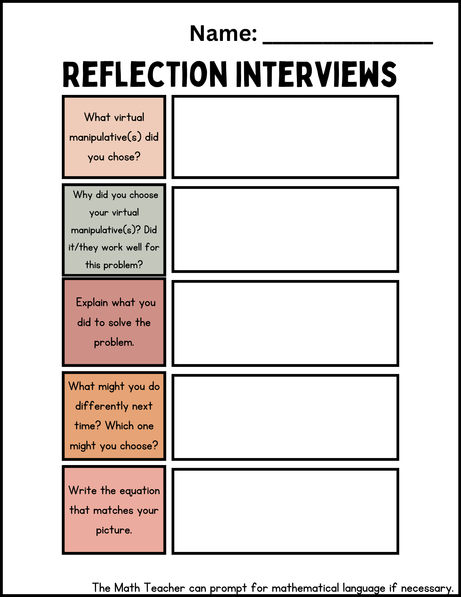
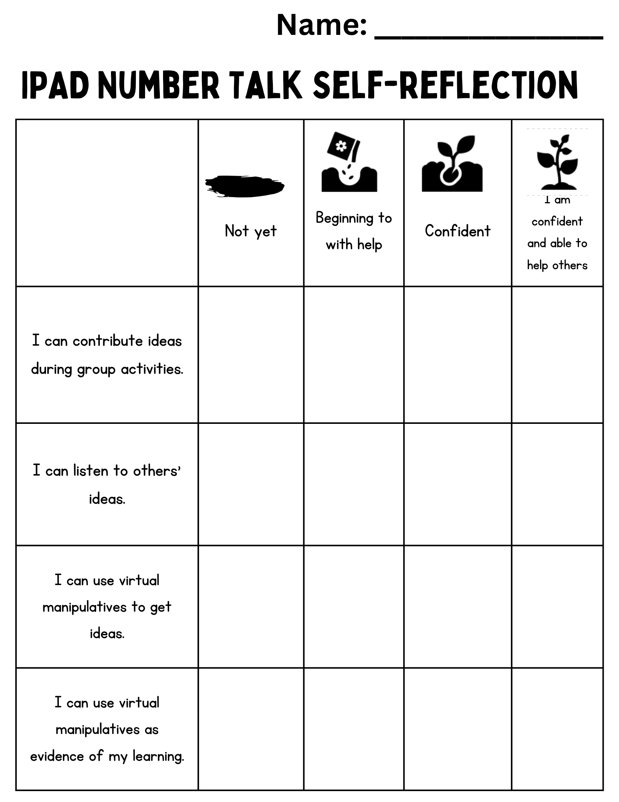

# Reflection Station

At the reflection station, the Math Teacher will distribute student’s screenshots from the previous day or display them digitally if using digital portfolios. Students will each take a turn explaining their screenshots to the group, with prompting from the Math Teacher if necessary. Students who are able to will complete the reflection interview sheet. We have created an example reflection interview sheet that teachers can adapt to fit their grade level. The Math Teacher will scribe for students who are unable to complete the sheet independently. The Math Teacher may decide to pose the number talk again and have the students complete it using physical manipulatives, drawings or with equations. This is also an opportunity to provide differentiation by posing a variation of the original number talk. At the end of each unit or term, students will do a core competency self-assessment to reflect upon their participation in the station activities. 

 
 

[ADDITIONAL RESOURCES](additional-resources.html){: .btn .btn-blue }
