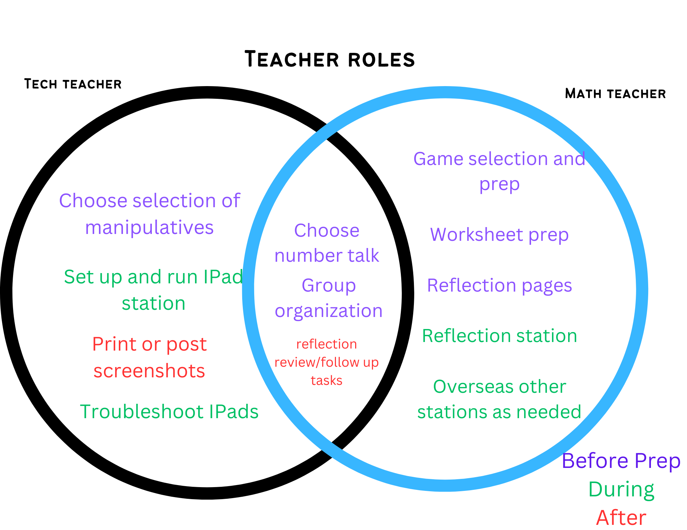

# Getting Ready 

- Once you have established your partnership, you are ready to start setting up for your stations. Here are the steps you will need to take to get prepared: 
    - Assign roles of Tech-Teach and Math Teacher (this can change after each unit or stay consistent throughout the partnership)
 
- Confirm days and times  
    - For stations (2 x 30 mins is ideal)
    - For collaboration (once a week – eg. At lunch, after/before school, prep-time, choice/catch-up time) 
- Select and Gather materials
    - One iPad per ¼ of students in class
    - Number talk resource (in number talks are not in current math curriculum)
    - Worksheets for current topic
    - Math game resource
    - Materials needed for games (ex. Playing cards, dice, dry-erase sheets and markers)
    - Reflection worksheet (see example)
    - Station weekly plan (see example)
    - Physical manipulatives
    - Select virtual manipulative sites (see choices) 
- Prepare Students and Space 
    - Divide students into 4 groups – assign each group a colour (or other label)
    - Establish locations in classroom for each station (use physical labels/signs if needed)
    - Introduce co-teacher and explain each teacher’s role
    - Walk through each station with the class as a whole
    - Remind/teach independence expectations (ex. not interrupting, staying on-task) 

[NEXT STEP: iPad Station](1-ipad-station.html){: .btn .btn-blue }
