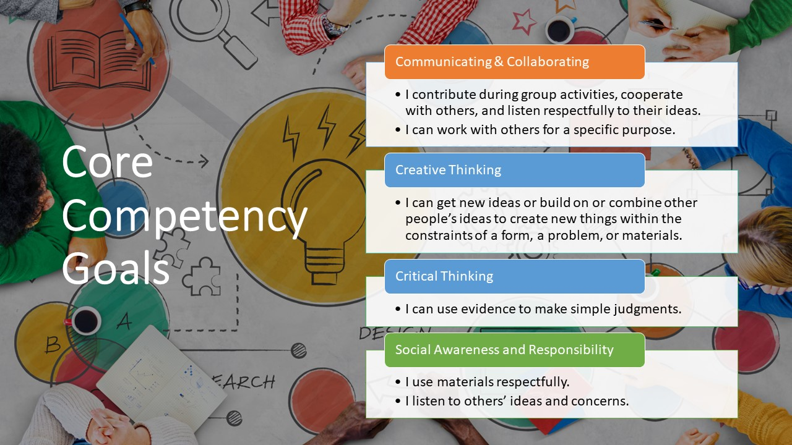
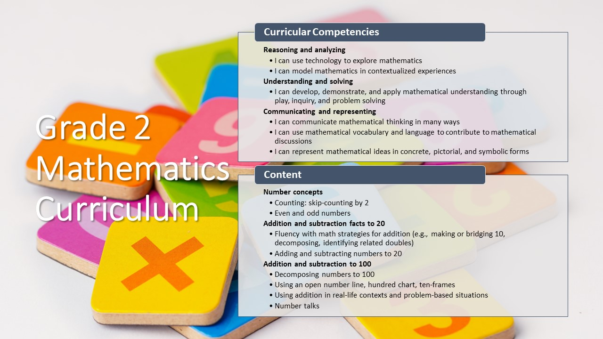

# Elementary Math Station Framework: Co-Teaching Number Talks with Virtual Manipulatives 

## Goal
The goal of this framework is for a classroom teacher and an inclusive education teacher to work collaboratively to reach all learners within the classroom. Students have diverse mathematical abilities and therefore mathematics can pose certain challenges. This is due to difficulties with working memory, slower processing speed, language processing difficulties, poor organization skills and challenge with focus and attention. The station model using the one teach-one tech approach, will allow the teaching partnership to integrate technology tools into mathematical learning in the classroom. 

## The Four Stations
- iPad Station: number talk with virtual manipulatives. 
- Reflection Station: self-reflection interview.
- Game Station: non-tech hands on partner game.
- Paperwork Station: worksheet or puzzle connected to current math unit.

 

## Learning objectives related to BC Curriculum
 

[NEXT STEP: Learning Design](learning-design.html){: .btn .btn-blue }
