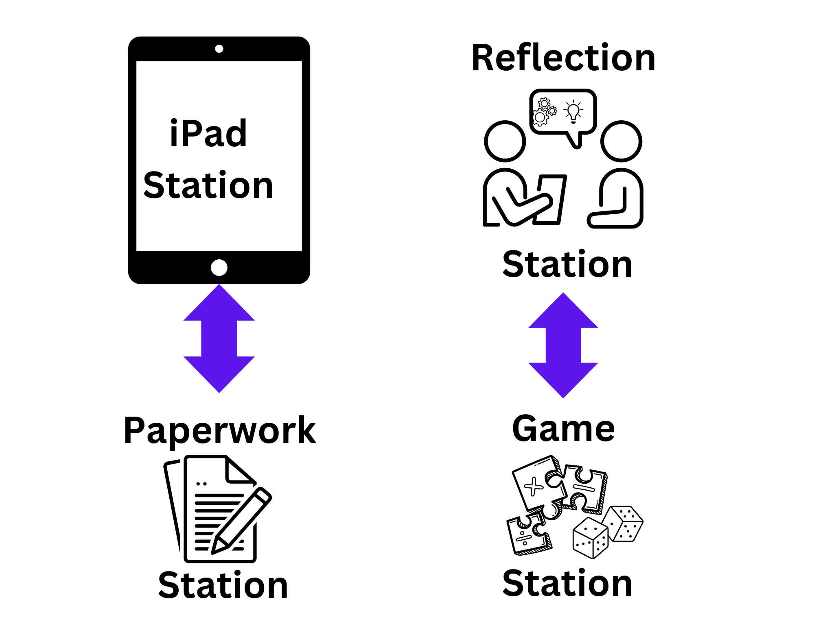

## Station Design

# iPad Station  

The Tech Teacher leads a number talk and the students use virtual manipulatives on their iPads to solve the problem. The Tech Teacher will have the virtual manipulative site preloaded with suggestions of manipulatives for students to choose from. After the students have represented their thinking with the virtual manipulatives, the Tech Teacher will ensure they have taken a screenshot. The Tech Teacher will print the screenshot or post it to the student’s digital portfolio so that they can access it when they are in the self-reflection station the next day.  

# Reflection Station 

The Math Teacher will distribute student’s screenshots from the previous day at the iPad station. Students will each take a turn explaining their screenshots to the group, with prompting from the Math Teacher if necessary. Students who are able to will complete the reflection interview sheet. The Math Teacher will scribe for students who are unable to complete the sheet independently.  
 
The Math Teacher may decide to pose the number talk again and have the students complete it using physical manipulatives, drawing or with equations. This is also an opportunity to provide differentiation by posing a variation of the original number talk.  

At the end of each unit or term, students will do a core competency self-assessment to reflect upon their participation in the station activities. 

# Paperwork Station  

Students will work independently at this station on worksheets that connect to the current classroom mathematics content. Teachers can provide options for differentiation based on student needs. An Education Assistant could support this station if available. 

# Game Station 

Students will play a game with their partner that connects to the current classroom mathematics content. It is recommended that the Math Teacher introduces the game on Day 1 before students move to their stations so that all students know the rules and objectives of the game.  

 
# Week 1: 
Do not do a number talk at the iPad station – instead, give the students a chance to explore the virtual manipulatives. Use the reflection station for exploring physical manipulatives and/or doing traditional number talks until there is work to reflect upon.  

 

Movement through stations: Students do not move between the stations in a circular rotation. The iPad station is grouped with the Paperwork Station while the Self-Reflection Station is grouped with the Game Station. For example, on day 1, the Yellow Group will visit the iPad Station then the Paperwork Station. On day 2, they will visit the   Self-Reflection Station then the Game Station. The Green Group will visit the Paperwork Station then the iPad Station on day 1 and the Game Station then the Self-Reflection Station on Day 2.  

[NEXT STEP: Getting Ready](activities-intro.html){: .btn .btn-blue }
