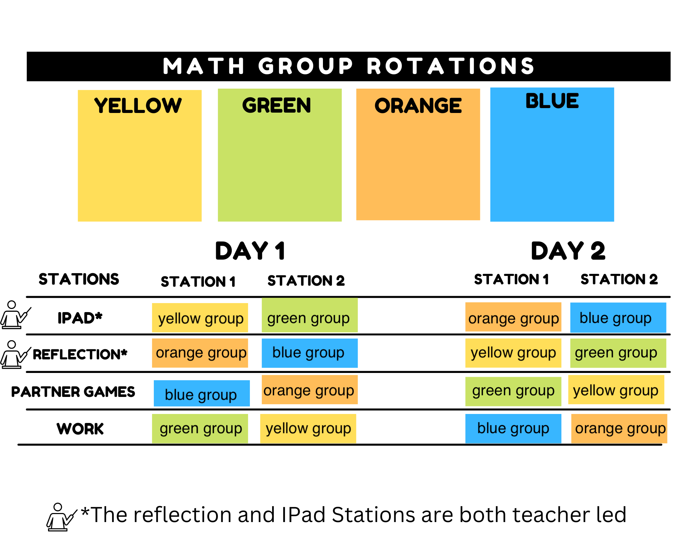

## Station Design

 
# Week 1: 
Do not do a number talk at the iPad station – instead, give the students a chance to explore the virtual manipulatives. Use the reflection station for exploring physical manipulatives and/or doing traditional number talks until there is work to reflect upon.  

 

## Movement through stations: 

Students do not move between the stations in a circular rotation. The iPad station is grouped with the Paperwork Station while the Self-Reflection Station is grouped with the Game Station. For example, on day 1, the Yellow Group will visit the iPad Station then the Paperwork Station. On day 2, they will visit the   Self-Reflection Station then the Game Station. The Green Group will visit the Paperwork Station then the iPad Station on day 1 and the Game Station then the Self-Reflection Station on Day 2.  

[NEXT STEP: iPad Station](1-ipad-station.html){: .btn .btn-blue }
